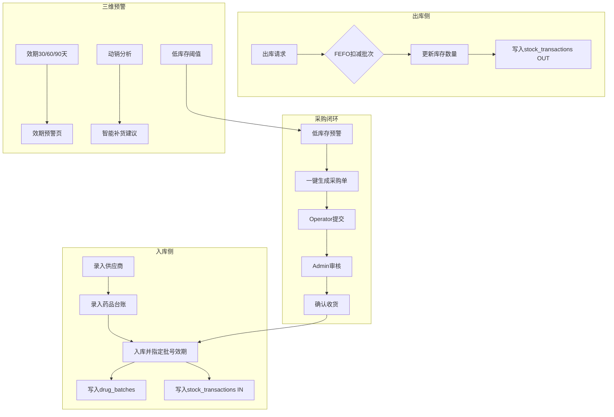
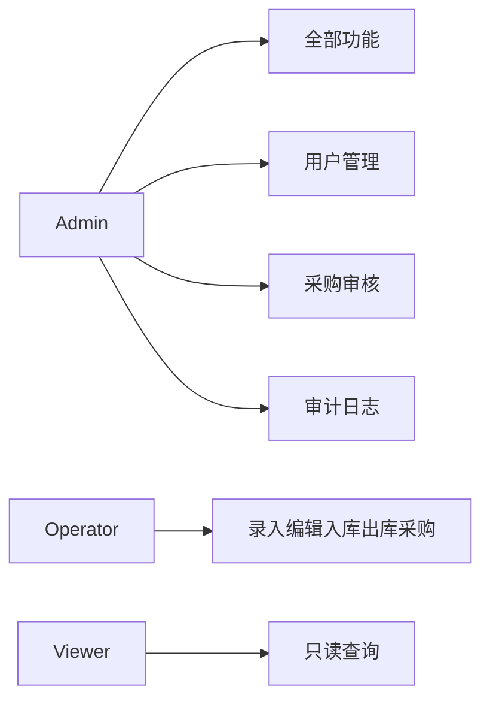

# 业务流程图

## 进销存主流程

## 角色与权限

## 演示自检路径

1. 登录 http://localhost:5100（admin / Admin@123）
2. 运营仪表盘 — 查看 KPI 与图表
3. 效期预警 — 确认临期批次
4. 低库存预警 — 导出 CSV
5. 采购单 — 生成 → 提交 → 审核 → 收货
6. 入库出库 — 流水筛选与导出
7. 审计日志（Admin）— 查看变更记录
