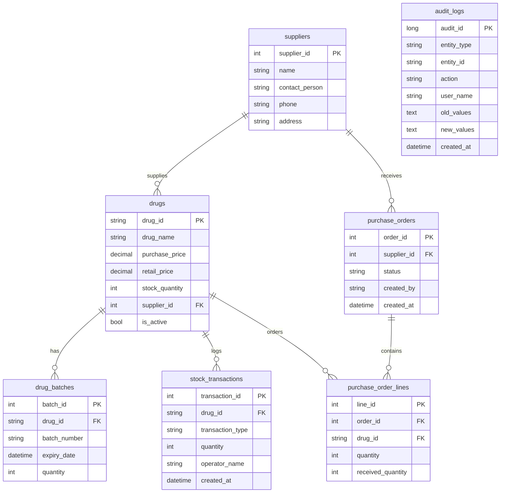

# ER 图（实体关系）

## 说明

- **库存一致性**：`drugs.stock_quantity` 仅通过 `stock_transactions` 与批次扣减联动变更，编辑药品不可直接改库存。
- **FEFO**：出库时按 `drug_batches.expiry_date` 先到期先扣减。
- **软下架**：`drugs.is_active = false` 表示下架，非物理删除。
